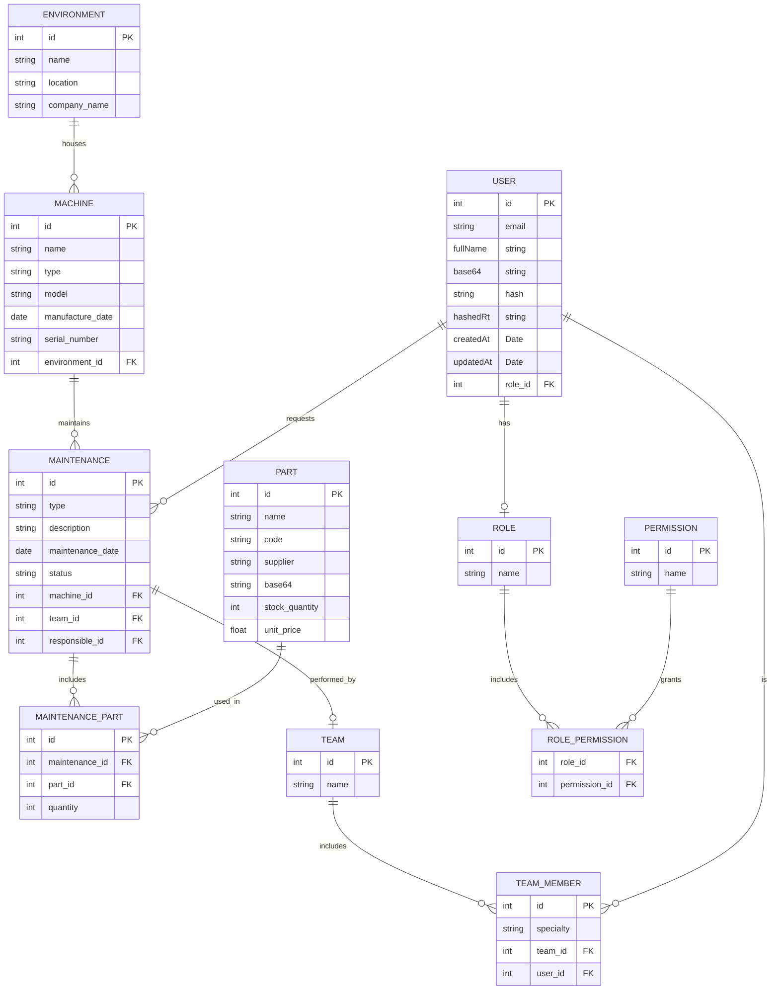

```mermaid
erDiagram
    ENVIRONMENT {
        int id PK
        string name
        string location
        string company_name
    }
    MACHINE {
        int id PK
        string name
        string type
        string model
        date manufacture_date
        string serial_number
        int environment_id FK
    }
    MAINTENANCE {
        int id PK
        string type
        string description
        date maintenance_date
        string status
        int machine_id FK
        int team_id FK
        int responsible_id FK
    }
    MAINTENANCE_PART {
        int id PK
        int maintenance_id FK
        int part_id FK
        int quantity
    }
    PART {
        int id PK
        string name
        string code
        string supplier
        string base64
        int stock_quantity
        float unit_price
    }
    TEAM {
        int id PK
        string name
    }
    TEAM_MEMBER {
        int id PK
        string specialty
        int team_id FK
        int user_id FK
    }
    USER {
        int id PK
        string email
        fullName string
        base64 string
        string hash
        hashedRt string
        createdAt Date
        updatedAt Date
        int role_id FK
    }
    ROLE {
        int id PK
        string name
    }
    PERMISSION {
        int id PK
        string name
    }
    ROLE_PERMISSION {
        int role_id FK
        int permission_id FK
    }

    ENVIRONMENT ||--o{ MACHINE : houses
    MACHINE ||--o{ MAINTENANCE : maintains
    MAINTENANCE ||--o{ MAINTENANCE_PART : includes
    PART ||--o{ MAINTENANCE_PART : used_in
    MAINTENANCE ||--o| TEAM : performed_by
    TEAM ||--o{ TEAM_MEMBER : includes
    USER ||--o{ MAINTENANCE : requests
    USER ||--o{ TEAM_MEMBER : is
    USER ||--o| ROLE : has
    ROLE ||--o{ ROLE_PERMISSION : includes
    PERMISSION ||--o{ ROLE_PERMISSION : grants


```
