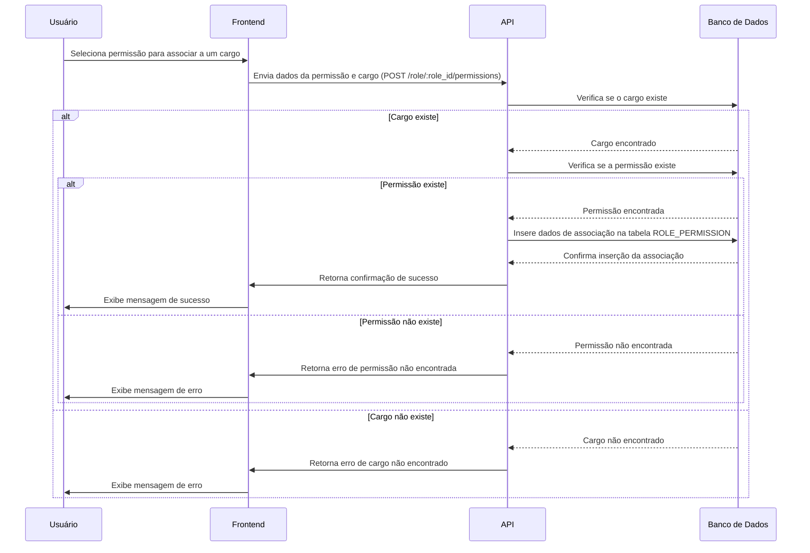

```mermaid
sequenceDiagram
    participant U as Usuário
    participant F as Frontend
    participant A as API
    participant D as Banco de Dados

    U->>F: Seleciona permissão para associar a um cargo
    F->>A: Envia dados da permissão e cargo (POST /role/:role_id/permissions)
    A->>D: Verifica se o cargo existe
    alt Cargo existe
        D-->>A: Cargo encontrado
        A->>D: Verifica se a permissão existe
        alt Permissão existe
            D-->>A: Permissão encontrada
            A->>D: Insere dados de associação na tabela ROLE_PERMISSION
            D-->>A: Confirma inserção da associação
            A->>F: Retorna confirmação de sucesso
            F->>U: Exibe mensagem de sucesso
        else Permissão não existe
            D-->>A: Permissão não encontrada
            A->>F: Retorna erro de permissão não encontrada
            F->>U: Exibe mensagem de erro
        end
    else Cargo não existe
        D-->>A: Cargo não encontrado
        A->>F: Retorna erro de cargo não encontrado
        F->>U: Exibe mensagem de erro
    end

```
