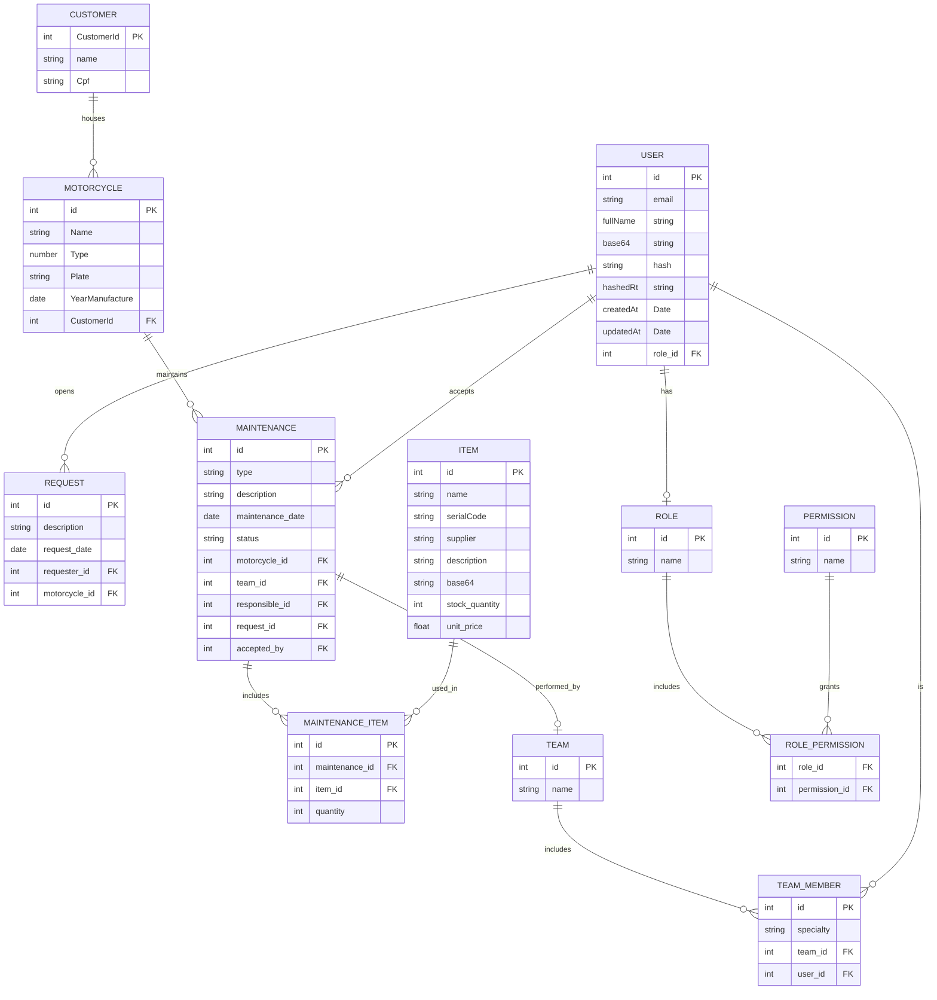

```mermaid
erDiagram
    CUSTOMER {
        int CustomerId PK
        string name
        string Cpf
    }
    MOTORCYCLE {
        int id PK
        string Name
        number Type
        string Plate
        date YearManufacture
        int CustomerId FK
    }
    REQUEST {
        int id PK
        string description
        date request_date
        int requester_id FK
        int motorcycle_id FK
    }
    MAINTENANCE {
        int id PK
        string type
        string description
        date maintenance_date
        string status
        int motorcycle_id FK
        int team_id FK
        int responsible_id FK
        int request_id FK
        int accepted_by FK
    }
    MAINTENANCE_ITEM {
        int id PK
        int maintenance_id FK
        int item_id FK
        int quantity
    }
    ITEM {
        int id PK
        string name
        string serialCode
        string supplier
        string description
        string base64
        int stock_quantity
        float unit_price
    }
    TEAM {
        int id PK
        string name
    }
    TEAM_MEMBER {
        int id PK
        string specialty
        int team_id FK
        int user_id FK
    }
    USER {
        int id PK
        string email
        fullName string
        base64 string
        string hash
        hashedRt string
        createdAt Date
        updatedAt Date
        int role_id FK
    }
    ROLE {
        int id PK
        string name
    }
    PERMISSION {
        int id PK
        string name
    }
    ROLE_PERMISSION {
        int role_id FK
        int permission_id FK
    }

    CUSTOMER ||--o{ MOTORCYCLE : houses
    MOTORCYCLE ||--o{ MAINTENANCE : maintains
    MAINTENANCE ||--o{ MAINTENANCE_ITEM : includes
    ITEM ||--o{ MAINTENANCE_ITEM : used_in
    MAINTENANCE ||--o| TEAM : performed_by
    TEAM ||--o{ TEAM_MEMBER : includes
    USER ||--o{ REQUEST : opens
    USER ||--o{ MAINTENANCE : accepts
    USER ||--o{ TEAM_MEMBER : is
    USER ||--o| ROLE : has
    ROLE ||--o{ ROLE_PERMISSION : includes
    PERMISSION ||--o{ ROLE_PERMISSION : grants

```
