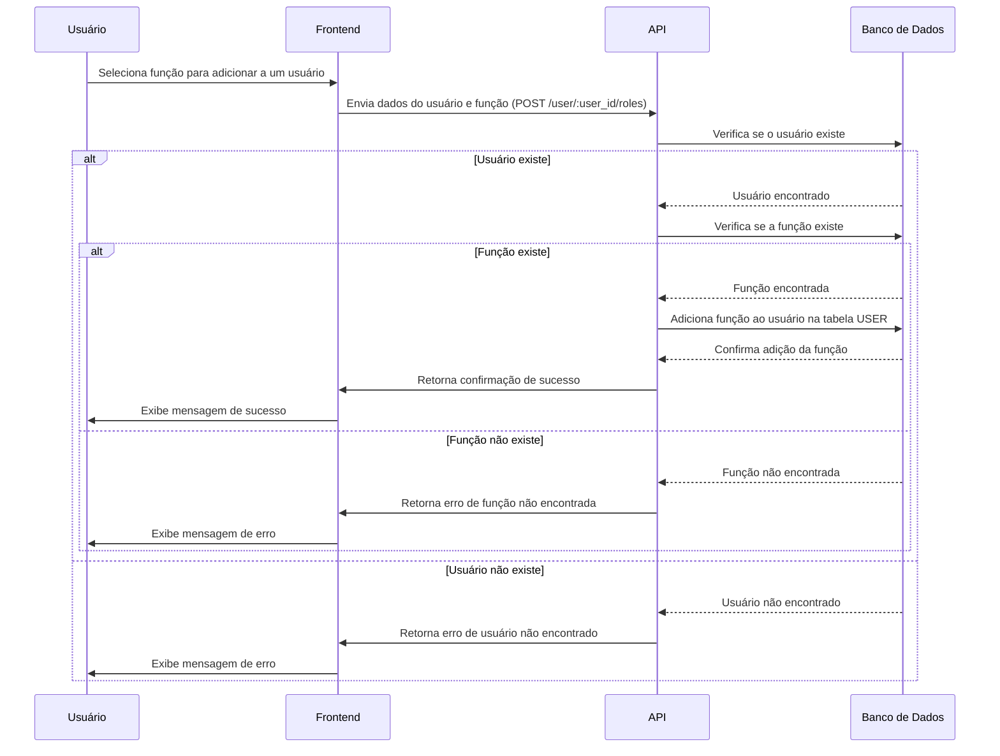

```mermaid
sequenceDiagram
    participant U as Usuário
    participant F as Frontend
    participant A as API
    participant D as Banco de Dados

    U->>F: Seleciona função para adicionar a um usuário
    F->>A: Envia dados do usuário e função (POST /user/:user_id/roles)
    A->>D: Verifica se o usuário existe
    alt Usuário existe
        D-->>A: Usuário encontrado
        A->>D: Verifica se a função existe
        alt Função existe
            D-->>A: Função encontrada
            A->>D: Adiciona função ao usuário na tabela USER
            D-->>A: Confirma adição da função
            A->>F: Retorna confirmação de sucesso
            F->>U: Exibe mensagem de sucesso
        else Função não existe
            D-->>A: Função não encontrada
            A->>F: Retorna erro de função não encontrada
            F->>U: Exibe mensagem de erro
        end
    else Usuário não existe
        D-->>A: Usuário não encontrado
        A->>F: Retorna erro de usuário não encontrado
        F->>U: Exibe mensagem de erro
    end

```