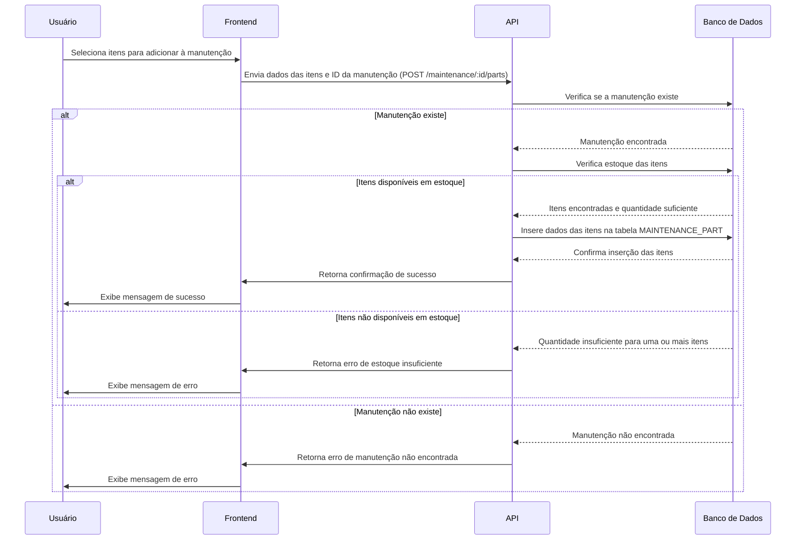

```mermaid
sequenceDiagram
    participant U as Usuário
    participant F as Frontend
    participant A as API
    participant D as Banco de Dados

    U->>F: Seleciona itens para adicionar à manutenção
    F->>A: Envia dados das itens e ID da manutenção (POST /maintenance/:id/parts)
    A->>D: Verifica se a manutenção existe
    alt Manutenção existe
        D-->>A: Manutenção encontrada
        A->>D: Verifica estoque das itens 
        alt Itens disponíveis em estoque
            D-->>A: Itens encontradas e quantidade suficiente
            A->>D: Insere dados das itens na tabela MAINTENANCE_PART
            D-->>A: Confirma inserção das itens
            A->>F: Retorna confirmação de sucesso
            F->>U: Exibe mensagem de sucesso
        else Itens não disponíveis em estoque
            D-->>A: Quantidade insuficiente para uma ou mais itens
            A->>F: Retorna erro de estoque insuficiente
            F->>U: Exibe mensagem de erro
        end
    else Manutenção não existe
        D-->>A: Manutenção não encontrada
        A->>F: Retorna erro de manutenção não encontrada
        F->>U: Exibe mensagem de erro
    end


```
