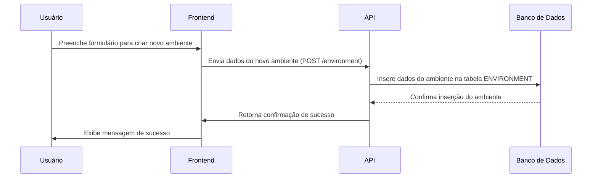

```mermaid
sequenceDiagram
    participant U as Usuário
    participant F as Frontend
    participant A as API
    participant D as Banco de Dados

    U->>F: Preenche formulário para criar novo ambiente
    F->>A: Envia dados do novo ambiente (POST /environment)
    A->>D: Insere dados do ambiente na tabela ENVIRONMENT
    D-->>A: Confirma inserção do ambiente
    A->>F: Retorna confirmação de sucesso
    F->>U: Exibe mensagem de sucesso
```
