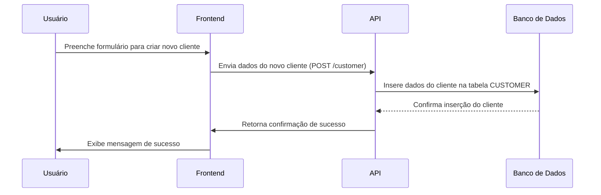

```mermaid
sequenceDiagram
    participant U as Usuário
    participant F as Frontend
    participant A as API
    participant D as Banco de Dados

    U->>F: Preenche formulário para criar novo cliente
    F->>A: Envia dados do novo cliente (POST /customer)
    A->>D: Insere dados do cliente na tabela CUSTOMER
    D-->>A: Confirma inserção do cliente
    A->>F: Retorna confirmação de sucesso
    F->>U: Exibe mensagem de sucesso
```
