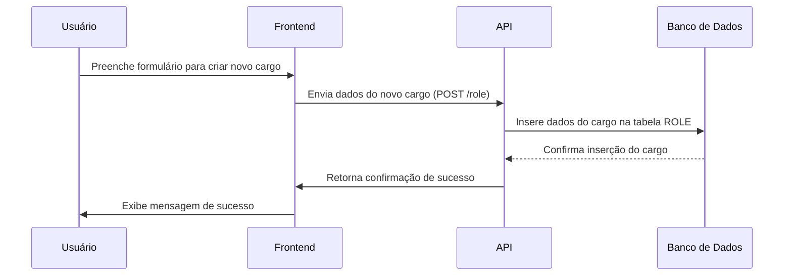

```mermaid
sequenceDiagram
    participant U as Usuário
    participant F as Frontend
    participant A as API
    participant D as Banco de Dados

    U->>F: Preenche formulário para criar novo cargo
    F->>A: Envia dados do novo cargo (POST /role)
    A->>D: Insere dados do cargo na tabela ROLE
    D-->>A: Confirma inserção do cargo
    A->>F: Retorna confirmação de sucesso
    F->>U: Exibe mensagem de sucesso

```