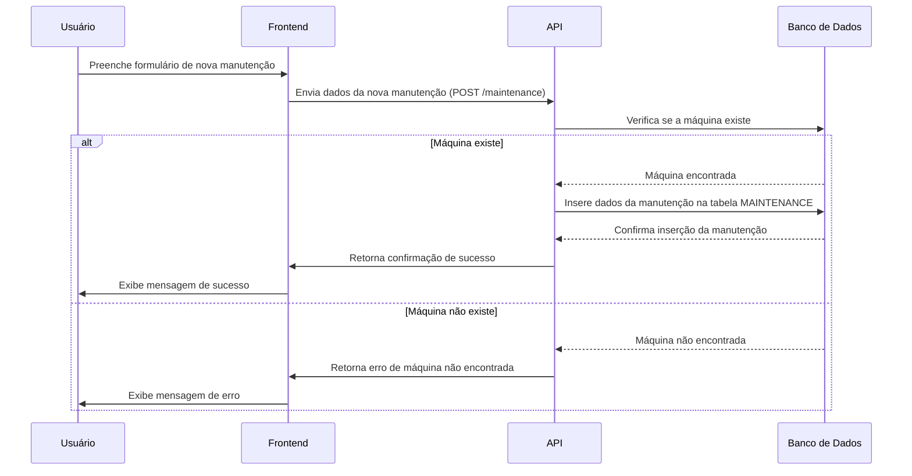

```mermaid
sequenceDiagram
    participant U as Usuário
    participant F as Frontend
    participant A as API
    participant D as Banco de Dados

    U->>F: Preenche formulário de nova manutenção
    F->>A: Envia dados da nova manutenção (POST /maintenance)
    A->>D: Verifica se a máquina existe 
    alt Máquina existe
        D-->>A: Máquina encontrada
        A->>D: Insere dados da manutenção na tabela MAINTENANCE
        D-->>A: Confirma inserção da manutenção
        A->>F: Retorna confirmação de sucesso
        F->>U: Exibe mensagem de sucesso


    else Máquina não existe
        D-->>A: Máquina não encontrada
        A->>F: Retorna erro de máquina não encontrada
        F->>U: Exibe mensagem de erro
    end

```
