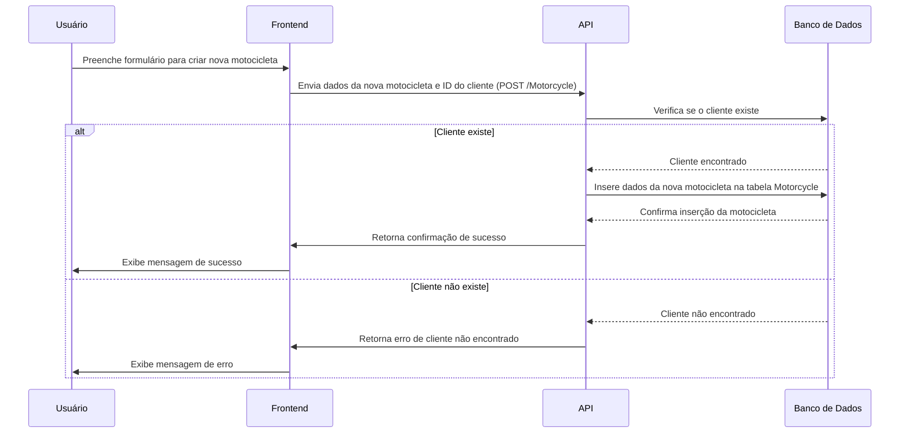

```mermaid
sequenceDiagram
    participant U as Usuário
    participant F as Frontend
    participant A as API
    participant D as Banco de Dados

    U->>F: Preenche formulário para criar nova motocicleta
    F->>A: Envia dados da nova motocicleta e ID do cliente (POST /Motorcycle)
    A->>D: Verifica se o cliente existe
    alt Cliente existe
        D-->>A: Cliente encontrado
        A->>D: Insere dados da nova motocicleta na tabela Motorcycle
        D-->>A: Confirma inserção da motocicleta
        A->>F: Retorna confirmação de sucesso
        F->>U: Exibe mensagem de sucesso
    else Cliente não existe
        D-->>A: Cliente não encontrado
        A->>F: Retorna erro de cliente não encontrado
        F->>U: Exibe mensagem de erro
    end


```
