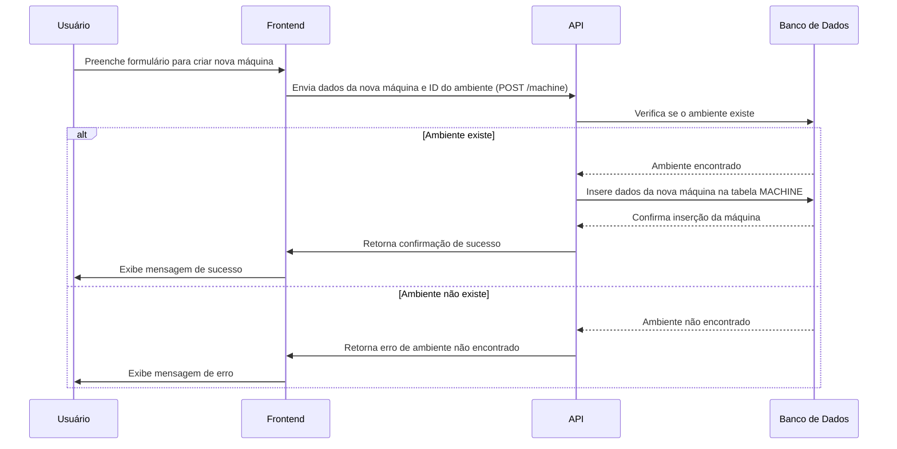

```mermaid
sequenceDiagram
    participant U as Usuário
    participant F as Frontend
    participant A as API
    participant D as Banco de Dados

    U->>F: Preenche formulário para criar nova máquina
    F->>A: Envia dados da nova máquina e ID do ambiente (POST /machine)
    A->>D: Verifica se o ambiente existe
    alt Ambiente existe
        D-->>A: Ambiente encontrado
        A->>D: Insere dados da nova máquina na tabela MACHINE
        D-->>A: Confirma inserção da máquina
        A->>F: Retorna confirmação de sucesso
        F->>U: Exibe mensagem de sucesso
    else Ambiente não existe
        D-->>A: Ambiente não encontrado
        A->>F: Retorna erro de ambiente não encontrado
        F->>U: Exibe mensagem de erro
    end


```
