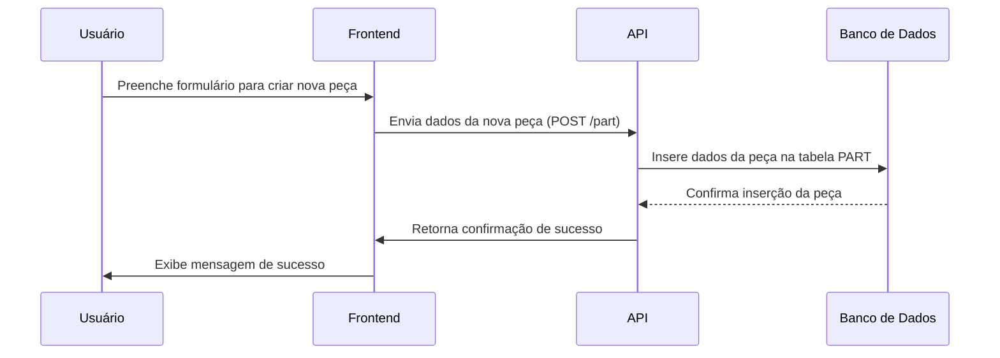

```mermaid
sequenceDiagram
    participant U as Usuário
    participant F as Frontend
    participant A as API
    participant D as Banco de Dados

    U->>F: Preenche formulário para criar nova peça
    F->>A: Envia dados da nova peça (POST /part)
    A->>D: Insere dados da peça na tabela PART
    D-->>A: Confirma inserção da peça
    A->>F: Retorna confirmação de sucesso
    F->>U: Exibe mensagem de sucesso

```