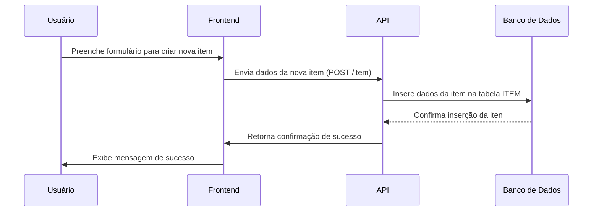

```mermaid
sequenceDiagram
    participant U as Usuário
    participant F as Frontend
    participant A as API
    participant D as Banco de Dados

    U->>F: Preenche formulário para criar nova item
    F->>A: Envia dados da nova item (POST /item)
    A->>D: Insere dados da item na tabela ITEM
    D-->>A: Confirma inserção da iten
    A->>F: Retorna confirmação de sucesso
    F->>U: Exibe mensagem de sucesso

```