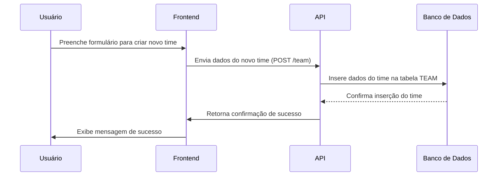

```mermaid
sequenceDiagram
    participant U as Usuário
    participant F as Frontend
    participant A as API
    participant D as Banco de Dados

    U->>F: Preenche formulário para criar novo time
    F->>A: Envia dados do novo time (POST /team)
    A->>D: Insere dados do time na tabela TEAM
    D-->>A: Confirma inserção do time
    A->>F: Retorna confirmação de sucesso
    F->>U: Exibe mensagem de sucesso

```