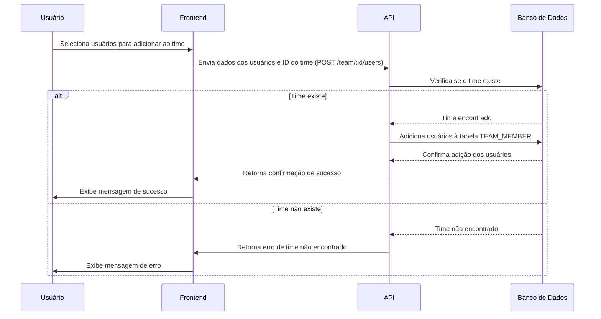

```mermaid
sequenceDiagram
    participant U as Usuário
    participant F as Frontend
    participant A as API
    participant D as Banco de Dados

    U->>F: Seleciona usuários para adicionar ao time
    F->>A: Envia dados dos usuários e ID do time (POST /team/:id/users)
    A->>D: Verifica se o time existe
    alt Time existe
        D-->>A: Time encontrado
        A->>D: Adiciona usuários à tabela TEAM_MEMBER
        D-->>A: Confirma adição dos usuários
        A->>F: Retorna confirmação de sucesso
        F->>U: Exibe mensagem de sucesso
    else Time não existe
        D-->>A: Time não encontrado
        A->>F: Retorna erro de time não encontrado
        F->>U: Exibe mensagem de erro
    end
```
