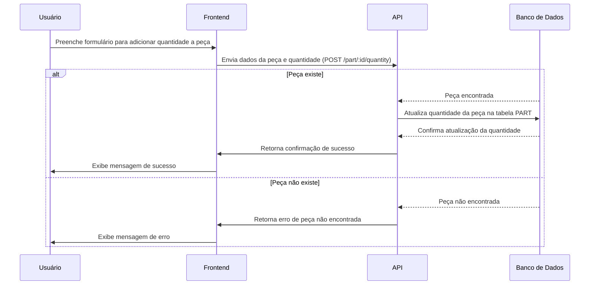

```mermaid
sequenceDiagram
    participant U as Usuário
    participant F as Frontend
    participant A as API
    participant D as Banco de Dados

    U->>F: Preenche formulário para adicionar quantidade a peça
    F->>A: Envia dados da peça e quantidade (POST /part/:id/quantity)
    alt Peça existe
        D-->>A: Peça encontrada
        A->>D: Atualiza quantidade da peça na tabela PART
        D-->>A: Confirma atualização da quantidade
        A->>F: Retorna confirmação de sucesso
        F->>U: Exibe mensagem de sucesso
    else Peça não existe
        D-->>A: Peça não encontrada
        A->>F: Retorna erro de peça não encontrada
        F->>U: Exibe mensagem de erro
    end

```
