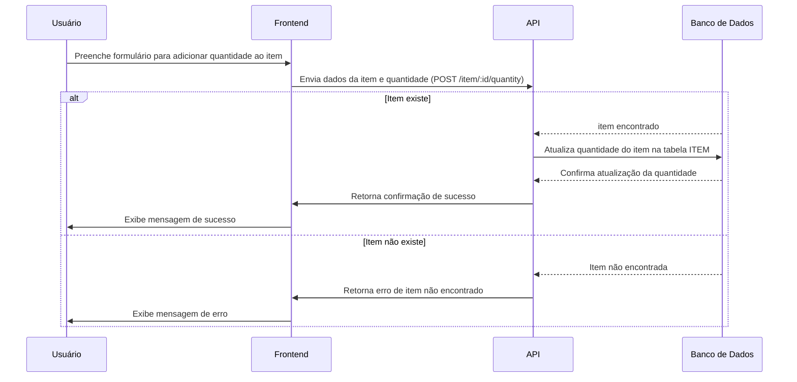

```mermaid
sequenceDiagram
    participant U as Usuário
    participant F as Frontend
    participant A as API
    participant D as Banco de Dados

    U->>F: Preenche formulário para adicionar quantidade ao item
    F->>A: Envia dados da item e quantidade (POST /item/:id/quantity)
    alt Item existe
        D-->>A: item encontrado
        A->>D: Atualiza quantidade do item na tabela ITEM
        D-->>A: Confirma atualização da quantidade
        A->>F: Retorna confirmação de sucesso
        F->>U: Exibe mensagem de sucesso
    else Item não existe
        D-->>A: Item não encontrada
        A->>F: Retorna erro de item não encontrado
        F->>U: Exibe mensagem de erro
    end

```
